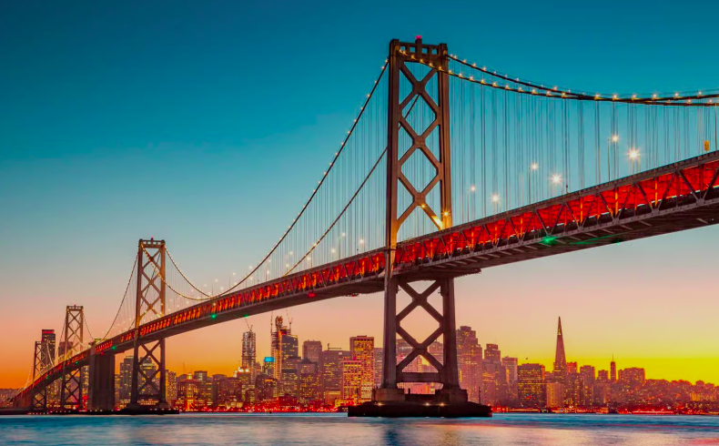
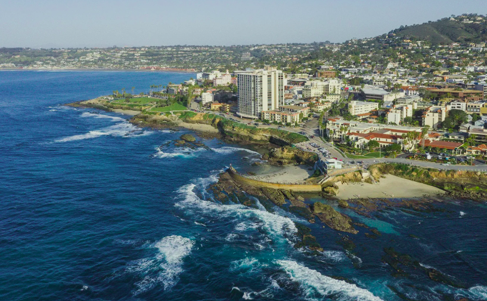
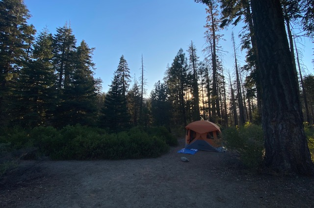
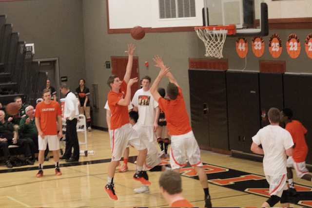
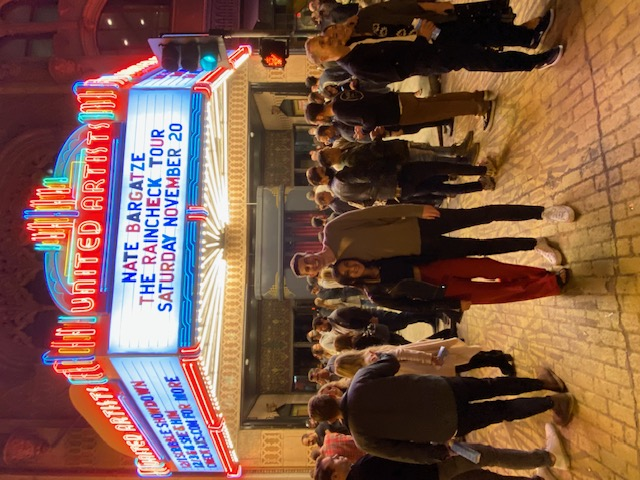
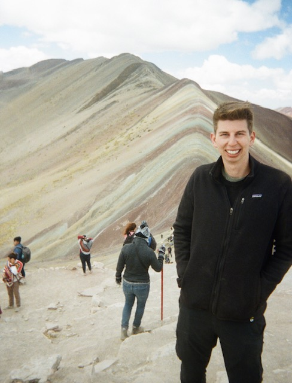
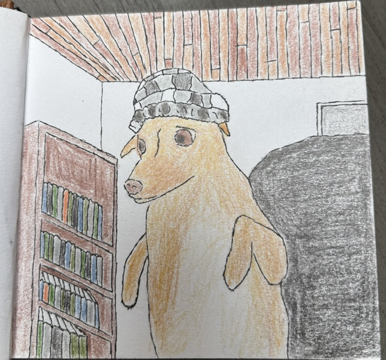
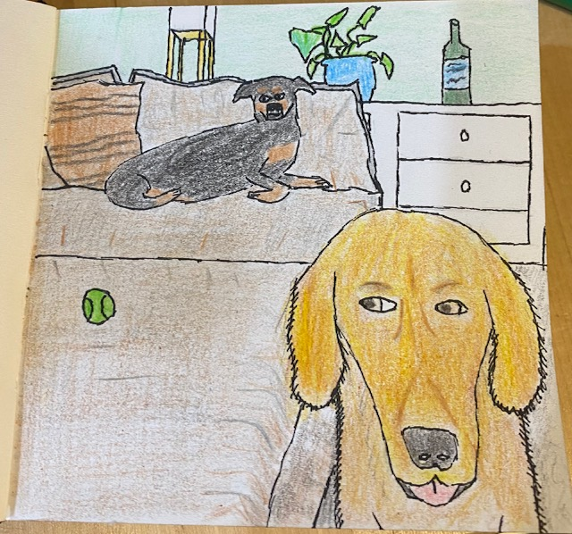
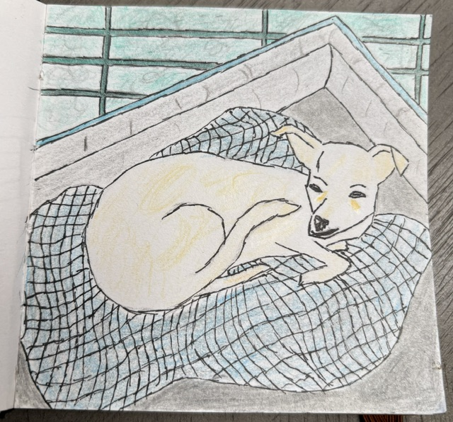

# Teague Quillin

Masters student of Business Intelligence and Process Management

Berlin School of Economics and Law

[https://www.linkedin.com/in/teaguequillin/](https://www.linkedin.com/in/teaguequillin/)

## Where I'm from

Born and raised in San Ramon, California, USA (45min outside San Francisco)

Lived in San Diego, California from 2016 to 2026

 

## My interests

Nature, Basketball, Comedy, Travel, Drawing weird pictures of my friend's dogs

 
 
  

## Academic and Career Journey

| Period | Role | Organization |
|--------|------|--------------|
| 2016-20 | Bachelors Accounting Student | San Diego State University |
| 2018-21 | Part-time Accounting Assistant | Aztec Shops llc |
| 2020-22 | Completed Certified Public Accountant Exams | State of California |
| 2021-23 | Senior Assurance Auditor | EY |
| 2024-26 | Senior Accountant of SEC Reporting and Equity | NeoGenomics Laboratories |
| 2026-Now | BIPM Masters student | HWR Berlin |

<iframe src="academic_journey_map.html" width="100%" height="500" style="border:none;"></iframe>

